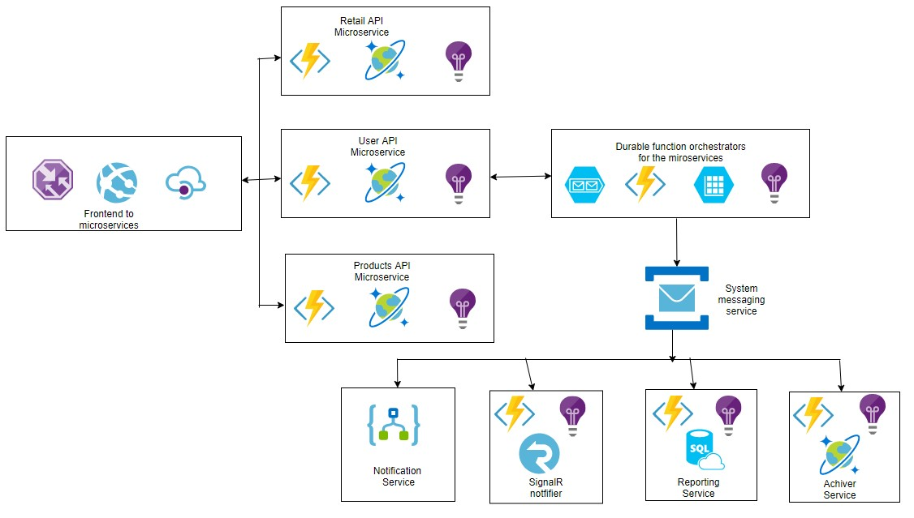

# :apple::watermelon:RetailMicroservice :department_store::man::woman:

## Architecture overview
Proof of concept for a fictitious retail Microservice 
- [Architecture overview](#architecture-overview)
  - [Macro architecture](#macro-architecture)
  - [Data flow](#data-flow)
  - [Deployment Tools](#deployment-tools)
  - [Monitoring Tools](#monitoring-tools)
  - [CICD Implementation](#cicd-implementation)
  - [GoLive Plan](#golive-plan)

## Macro architecture

The proposed Retail application will use the following macro architecture:

The architecture major building blocks are:

| Component             | Technology                                                                                          | Description                                                                                                                                                                                                                                                                                                                                                                                 |
| --------------------- | --------------------------------------------------------------------------------------------------- | ------------------------------------------------------------------------------------------------------------------------------------------------------------------------------------------------------------------------------------------------------------------------------------------------------------------------------------------------------------------------------------------- |
| Retail Web App     | Vue.js or React SPA                                                                                          | A multi-purpose, single-page application web app that allows users to sign up and sign in against a B2C Active Directory instance. Users have different levels and permissions. For example, a buyer can make purchases and checkout those items added to their chart . Sellers, on the other hand, upload their products to the collections and they can check their revenue or proceeds |
| Traffic Manager           | [Traffic Manager](https://docs.microsoft.com/en-gb/azure/traffic-manager/)                               | Azure Traffic Manager is a DNS-based traffic load balancer that enables you to distribute traffic optimally to services across global Azure regions, while providing high availability and responsiveness                                                                                                                                                                   |
| API Manager           | [Azure API Manager](https://docs.microsoft.com/azure/api-management/)                               | An API gateway that acts as a front-end to the solution APIs. Among many other benefits, the API management service provides RideShare APIs with security verification, usage telemetry, documentation and rate limiting.                                                                                                                                                                   |
| Retail App APIs        | C# [Azure Functions](https://azure.microsoft.com/services/functions/)                               | Three Function Apps are deployed to serve the Retail App APIs: Retails, Users and Products. These APIs are exposed to the Web App applications via the API manager and provide CRUD operations for each of Retail entities.                                                                                                                                                               |
| Durable Orchestrators | C# [Durable Functions](https://docs.microsoft.com/azure/azure-functions/durable-functions-overview) | Users Management, Monitor and Demo orchestrators are deployed to manage the user transactions and provide real-time status updates. The orchestrators are launched for the duration of the transaction and they perform management and monitoring functions. In essence, these orchestrators make up the heart of the solution.                |
| Service Bus Queue/Topic         | [Service Bus](https://docs.microsoft.com/en-us/azure/service-bus-messaging/overview)                            | A custom queue used where user transactions details will be dropped for processing using the publish-subscribe model. Service bus queue works best for transactional operations.                                                                                                                                                                                                                      |
| Key Vault             | [Azure Key Vault](https://docs.microsoft.com/azure/key-vault/key-vault-overview)                    | All secrets, such as database connection strings and keys are securely stored in Azure Key Vault. This prevents accidental leakage of sensitive values and the same keys can be easily shared by multiple services. This is a best practice approach for scoring those credentials that need to be abstracted away from developers and other users.                                                                                                                                                                      |

The following are the Service Bus Topic Subscribers:

| Subscriber   | Technology                                                    | Description                                                                                               |
| ------------ | ------------------------------------------------------------- | --------------------------------------------------------------------------------------------------------- |
| Notification | [Logic App](https://azure.microsoft.com/services/logic-apps/) | A purchase processor to notify Sellers i.e. emails or SMS as a buyer checkouts items from their chart..     |
| SignalR      | C# Azure Function                                             | A order processor to update buyers (via browsers or mobile apps) in real-time about order status.       |
| Reporting System     | C# Azure Function                                             | A purchase processor to insert the ordes into an SQL Database and possibly into a reporting system (via APIs). |
| Function Achiver     | C# Azure Function                                        | A purchase processor to archive the sales into Azure Cosmos DB                                                 |

## Data Flow
The proposed Retail application will have certain components integrated has shown below:

- Traffic Manager: The traffic manager will serve as the entry point into the application. This is to allow for high availability. The web application will be deployed to multiple regions; which allows the traffic manager route to the most available node(application).

- The APIs are integrated into the web application via the Azure API Management Instance.
- The APIs(Retail, User and Products) are connected to the cosmos DB which offers a NoSQL database and provides that global availablity because of it's great replication strategies.
- It is almost important to note at this point that all the function applications will be monitored using the Azure monitor application called Application Insights(more details below).
- The durable function which is also a function application but is one that will maintain the state of the application. This will allow for transaction orchestration and the necessary flows needed by the microservices. It will be the orchestrator of all the processes.
- The system message service that will be used is the service bus since it offers the best transaction workflow for scenarios that involve financial transactions and reversals. This is just a few of the benefits.
- The signaling services for mobile/web applications, email notifications via logic apps and transactions archiving will be served via the service bus queue or topic as the use case changes.

## Deployment Tools
- The Infrastructure as code(IaC) tool(s) that will be used is Terraform and a bit of ARM Templates. The reason for my choice is as itemized below:
1. Terraform is a multi-cloud IaC tool; this means it can be used to deploy infrasture to any of the major cloud providers availiable e.g Azure, AWS, GCP etc.
2. It deployment enables you to maintain the state of the deployment. Which means you can see the state of the deployed resources before or after deployment
3. It shines brightest in the sense that it allows for immutability
  -The concept that resources can be created and destroyed; never changed
  -It is very similar to the blue/green deployment concept.
4. ARM templates will be used because that is the IaC readily available on Azure. It can be combined with Terraform if certain deployment cases are not available with Terraform alone.

## Monitoring Tools
For monitoring Azure really provides a great tool which can be used to monitor applications end-to-end transaction details and it also allows for Alerts configuration in the event of Azure planned or unplanned Infrastructure updates. Find more reading in [Azure Monitor](https://docs.microsoft.com/en-us/azure/azure-monitor/)

## CICD Implementation
For continuous integration and Continuous development; the tools of choice will be Jenkins(Integration) and for development is would be Azure DevOps Pipeline. The integration will be done in a blue/green deployment strategy where we will deploy to a Development( alias Dev) environment test the functionalities before approving the release to the Production(alias Prod) envrionment. The Build and release pipelines will be seperate so that artifacts from the build pipeline will be released to the desired environment.
These will prevent unnecessary build processes. 

## GoLive Plan