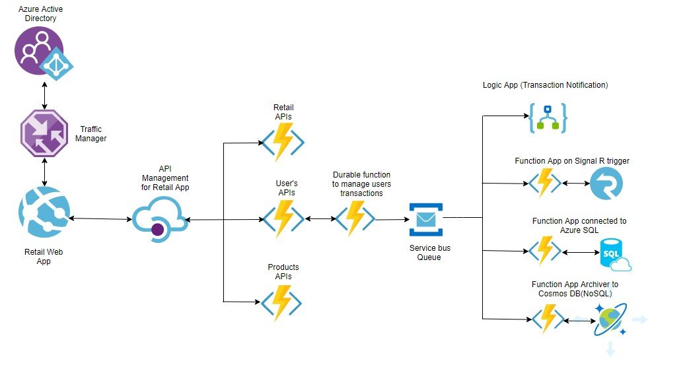

# :apple::watermelon:RetailMicroservice :department_store::man::woman:
Proof of concept for a fictitious retail Microservice 
- [Architecture overview](#RetailMicroservice)
  - [Macro architecture](#macro-architecture)
  - [Data flow](#data-flow)

## Macro architecture

The proposed Retail application will use the following macro architecture:

The architecture major building blocks are:

| Component             | Technology                                                                                          | Description                                                                                                                                                                                                                                                                                                                                                                                 |
| --------------------- | --------------------------------------------------------------------------------------------------- | ------------------------------------------------------------------------------------------------------------------------------------------------------------------------------------------------------------------------------------------------------------------------------------------------------------------------------------------------------------------------------------------- |
| Retail Web App     | Vue.js or React SPA                                                                                          | A multi-purpose, single-page application web app that allows users to sign up and sign in against a B2C Active Directory instance. Users have different levels and permissions. For example, a buyer can make purchases and checkout those items added to their chart . Sellers, on the other hand, upload their products to the collections and they can check their revenue or proceeds |
| Traffic Manager           | [Traffic Manager](https://docs.microsoft.com/en-gb/azure/traffic-manager/)                               | Azure Traffic Manager is a DNS-based traffic load balancer that enables you to distribute traffic optimally to services across global Azure regions, while providing high availability and responsiveness                                                                                                                                                                   |
| API Manager           | [Azure API Manager](https://docs.microsoft.com/azure/api-management/)                               | An API gateway that acts as a front-end to the solution APIs. Among many other benefits, the API management service provides RideShare APIs with security verification, usage telemetry, documentation and rate limiting.                                                                                                                                                                   |
| Retail App APIs        | C# [Azure Functions](https://azure.microsoft.com/services/functions/)                               | Three Function Apps are deployed to serve the Retail App APIs: Retails, Users and Products. These APIs are exposed to the Web App applications via the API manager and provide CRUD operations for each of Retail entities.                                                                                                                                                               |
| Durable Orchestrators | C# [Durable Functions](https://docs.microsoft.com/azure/azure-functions/durable-functions-overview) | Users Management, Monitor and Demo orchestrators are deployed to manage the user transactions and provide real-time status updates. The orchestrators are launched for the duration of the transaction and they perform management and monitoring functions. In essence, these orchestrators make up the heart of the solution.                |
| Service Bus Queue/Topic         | [Service Bus](https://docs.microsoft.com/en-us/azure/service-bus-messaging/overview)                            | A custom queue used where user transactions details will be dropped for processing using the publish-subscribe model. Service bus queue works best for transactional operations.                                                                                                                                                                                                                      |
| Key Vault             | [Azure Key Vault](https://docs.microsoft.com/azure/key-vault/key-vault-overview)                    | All secrets, such as database connection strings and keys are securely stored in Azure Key Vault. This prevents accidental leakage of sensitive values and the same keys can be easily shared by multiple services. This is a best practice approach for scoring those credentials that need to be abstracted away from developers and other users.                                                                                                                                                                      |

The following are the Service Bus Topic Subscribers:

| Subscriber   | Technology                                                    | Description                                                                                               |
| ------------ | ------------------------------------------------------------- | --------------------------------------------------------------------------------------------------------- |
| Notification | [Logic App](https://azure.microsoft.com/services/logic-apps/) | A purchase processor to notify Sellers i.e. emails or SMS as a buyer checkouts items from their chart..     |
| SignalR      | C# Azure Function                                             | A order processor to update buyers (via browsers or mobile apps) in real-time about order status.       |
| Reporting System     | C# Azure Function                                             | A purchase processor to insert the ordes into an SQL Database and possibly into a reporting system (via APIs). |
| Function Achiver     | C# Azure Function                                        | A purchase processor to archive the sales into Azure Cosmos DB                                                 |

## Data Flow